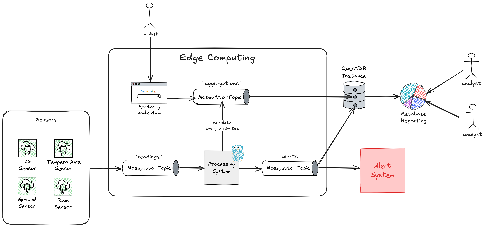

# About

Real-time data processing systems often prioritize high throughput and horizontal scalability, which presupposes access to robust infrastructure and abundant computational resources. However, in many real-world scenarios—such as environmental monitoring networks in remote regions, precision agriculture applications, or autonomous weather stations—the continuous transmission of data to the cloud is constrained by factors such as intermittent connectivity, energy consumption, network latency, and hardware limitations.

In these contexts, it becomes essential that part of the processing occurs directly at the edge, close to the sensors. However, executing aggregation algorithms, anomaly detection, metric correlation, and local persistence with consistency, low latency, and resource efficiency remains a technical challenge—especially when running on devices with 1 vCPU and 2 GB of RAM, such as a Raspberry Pi 4.

This work aims to investigate and demonstrate how architectures based on open-source streaming technologies can be optimized to perform distributed environmental processing directly at the edge, even in scenarios with hundreds of metrics per second, multiple concurrent streams, and strict temporal coordination requirements.



# How to run

- Start Docker services, in detached mode.
```sh
docker-compose up -d
```

- Start event publisher service
```sh
docker exec -it publisher go run ./publisher
```

- Start event subscriber service
```sh
docker exec -it subscriber go run ./subscriber
```

- (Optional) Start observer service to container monitoring (CPU, memory usage and I/O)
```sh
docker exec -it observer python app.py
```
